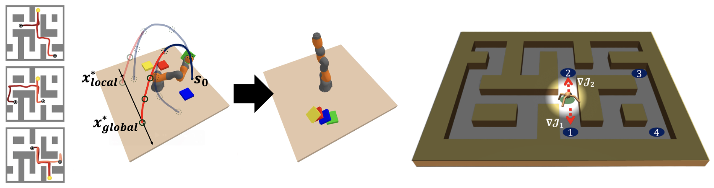

# Tree-Guided Diffusion Planner

<table width="100%">
<tr><td align="center">
  
  <div><em>Figure 1: <strong>TDP</strong> solves a variety of zero-shot planning problems.</em></div>
</td></tr>
</table>

> __Tree-Guided Diffusion Planner__  
> [Hyeonseong Jeon](https://yeonsumia.github.io), [Cheolhong Min](https://cheolhong0916.github.io), [Jaesik Park](https://jaesik.info)  
> _NeurIPS 2025_  
> __[Project page](https://tree-diffusion-planner.github.io)&nbsp;/ [arXiv](https://arxiv.org/abs/2508.21800)&nbsp;/ [BibTex](#citation)__

## Overview
This repository is organized into three separate sub-branches for each task:

- <strong>Maze2D Gold Picking</strong>: `maze2d` branch
- <strong>KUKA Robot Arm manipulation</strong>: `kuka` branch
- <strong>AntMaze Multi-goal Exploration</strong>: `antmaze` branch

## Citation
If you find <strong>TDP</strong> helpful, please consider citing:
```bibtex
@article{jeon2025tree,
  title={Tree-Guided Diffusion Planner},
  author={Jeon, Hyeonseong and Min, Cheolhong and Park, Jaesik},
  journal={arXiv preprint arXiv:2508.21800},
  year={2025}
}
```

## Acknowledgement
This codebase is built upon the foundations of [Diffuser](https://github.com/jannerm/diffuser), [TAT](https://github.com/langfengQ/tree-diffusion-planner) and [CleanDiffuser](https://github.com/CleanDiffuserTeam/CleanDiffuser).